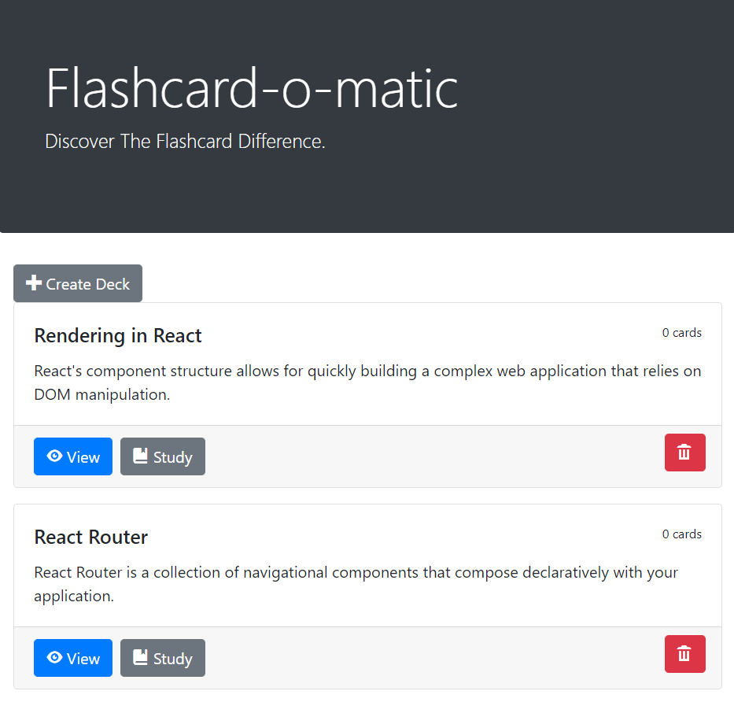

# Project Flashcards

The application allows teachers to create, update, read and delete decks of flashcards. Students can view the decks or study the decks.

## Built With

* React.js
* Bootstrap
* JSX
* Javascript

## Screenshot

